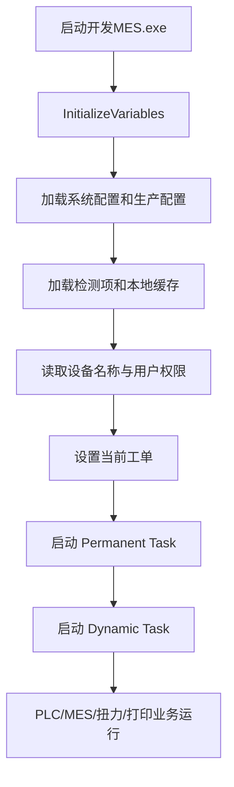
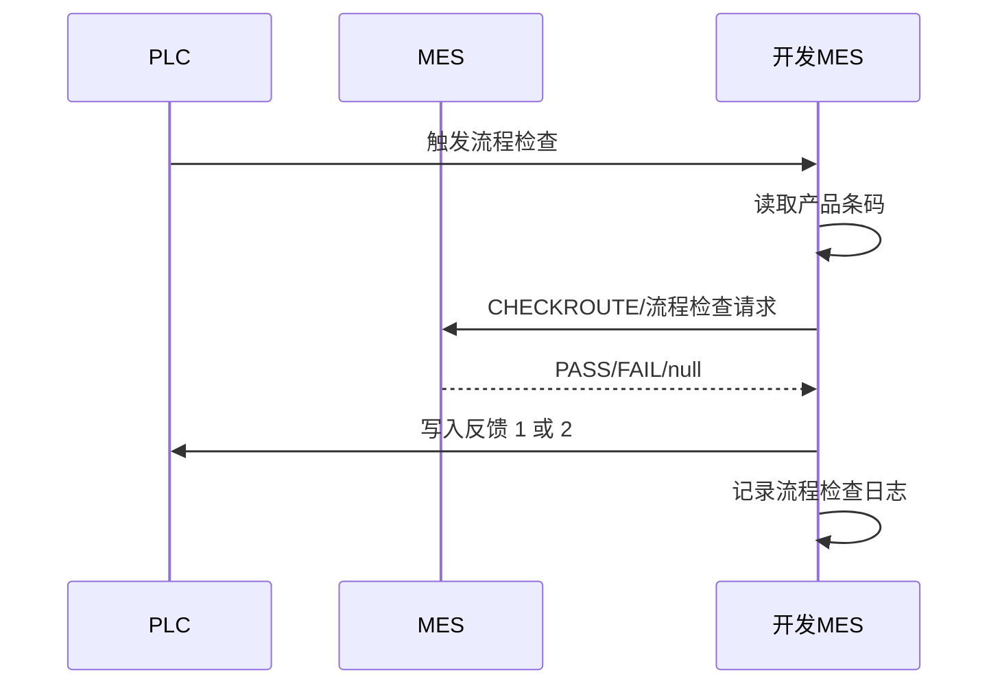
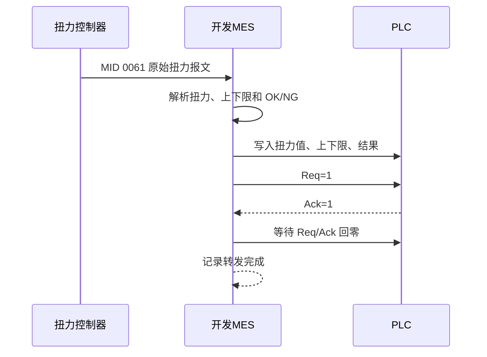
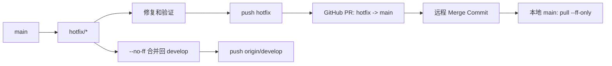

# GWKF 开发 MES 快速交接手册

## 1. 项目定位

本项目是基于 .NET Framework 4.7.2 的 WinForms MES 现场程序，负责连接 PLC、MES、扭力控制器、串口扭力仪和可选的 Codesoft/LabelManager 打标软件，完成设备生产数据采集、流程验证、产品过站、标签打印和设备状态上报。

程序主窗体为 `MesDatas/Views/Form1.cs`，大部分生产运行逻辑、PLC 轮询、MES 交互和后台任务都从这里启动。

当前稳定发布版本：`v1.1.0`。

## 2. 启动顺序

程序启动后，主流程大致如下：



`Form1` 窗体加载阶段主要完成：

1. 加载 `SystemInfo` 生产配置。
2. 加载产品检测项、PLC 地址和设备配置。
3. 加载最近的 Weight MES 状态缓存。
4. 初始化 MES Token 和 HTTP 客户端。
5. 设置设备名称、权限、工单和界面数据。
6. 启动永久任务和动态任务。

## 3. Permanent Task 与 Dynamic Task

### 3.1 Permanent Task

永久任务在程序启动后持续运行，生命周期通常与主窗体一致：

| 任务 | 主要职责 |
| --- | --- |
| `InterfaceHeatBeat` | 按配置周期调用设备心跳接口，更新设备在线状态。 |
| `_plcManager.StartConnectionTaskAsync` | 建立和维护 PLC 连接，向业务层提供 PLC 读写对象。 |
| `Recovery` | 监听 PLC 复位信号，触发报警复位和错误处理。 |
| `DeviceStatusUpload` | 读取设备 RUN/IDLE/STOP 等状态，状态变化时或超过约 5 分钟未上传时上报 MES。 |
| `StartMesOutboxRetryTask` | “先反馈再上传”模式下，后台重试本地 MES 补传记录。 |

永久任务不应依赖单次产品过站才能运行。排查 PLC 或 MES 长连接问题时，优先检查这些任务的异常日志和连接状态。

### 3.2 Dynamic Task

动态任务由 `SetDynamicTaskStart` 启动，切换生产配置或重启任务时会取消并重新创建：

| 任务 | 主要职责 |
| --- | --- |
| `ProcessPlc_ReadBarcode` | 读取产品条码、工装条码等 PLC 信号并触发对应流程。 |
| `ProcessPlc_ReadValue` | 非装配机设备读取生产数据、工单号和测试结果。 |
| `ProcessPlc_ReadValue1/2/3` | 装配机不同工序读取生产数据、工单号和测试结果。 |
| `CallKeyArgsInterface` | 上传关键参数。 |
| `ReadDeviceArgsRealtime` | 实时读取设备运行参数。 |
| `MonitorModelSwitchFromPlc` | 监听 PLC 型号变化并更新当前工单/型号配置。 |
| `CallDeviceErrorUpload` | 监听并上传设备预警、报警信息。 |
| `CallRealtimeArgsInterface` | 按配置周期上传实时生产参数。 |
| `InitTorqueSystem` | 启动两个扭力控制器和 PLC 扭力转发流程。 |
| `InitSerialTorqueSystem` | 启动串口扭力仪和点检扭力采集。 |
| `CallPrintBarCode` | 仅在定义 `UseCodesoft` 时启动，负责模板标签打印。 |

动态任务停止时会取消 `CancellationTokenSource`，等待任务退出，并关闭 PLC 管理器。新增后台任务时必须考虑取消、重启和异常退出行为。

## 4. 主要业务流程

### 4.1 流程检查

流程检查用于在产品过站前验证当前产品是否允许进入后续工序，入口主要在产品条码读取后的 PLC 流程中。

基本流程：



处理重点：

- PLC 触发地址和反馈地址来自界面配置的 `PlcAddressInfo`，不要在代码或现场文档中写死具体 D 地址。
- 支持条码规则验证、型号校验、拼版条码获取和 MES 流程检查。
- PASS 后只有在 PLC 写入反馈成功时才记录最终通过结果。
- FAIL、MES 无响应、返回 `null`、条码校验失败和本地规则失败进入现有错误处理流程。
- 阻塞错误需要人工清除；非阻塞错误由后台完成 PLC 反馈。
- 流程日志 UI 与本地日志文件使用相同的完整文本，便于按时间排查现场问题。

### 4.2 产品过站

产品过站由 `GetProductResult` 和 `SendResultToMes` 等逻辑协作完成，主要步骤如下：

1. 从 PLC 读取产品结果和产品条码。
2. 读取测试项实际值、上下限和结果。
3. 按配置执行本地规则、型号、条码和拼版校验。
4. 组装产品过站数据并请求 MES 过站接口。
5. 根据 MES PASS/FAIL/null 和产品过站模式决定 PLC 反馈值。
6. 记录产品过站日志、MES 交互日志和数据异常日志。
7. 在“先反馈再上传”模式下，先写 PLC 反馈，再由 MES Outbox 后台补传。

常见产品过站模式包括：

- 显示 NG 且阻塞。
- 显示 NG 且不阻塞。
- 强制过站或屏蔽上传配置。
- 流程检查关闭或离线模式。
- 先反馈再上传。

产品过站主日志只记录关键节点；MES 请求报文、响应报文和异常原因写入 MES 交互或数据异常日志，避免现场主日志过度膨胀。

### 4.3 标签打印

标签打印由 `CallPrintBarCode` 和 `printTest_Click` 等逻辑负责，使用第三方 `Interop.LabelManager2.dll` 调用 Codesoft/LabelManager 软件。

打印前置条件：

1. 现场安装并正确注册 Codesoft/LabelManager 打标软件。
2. 项目引用的 `LocalLibs/Interop.LabelManager2.dll` 存在。
3. 生产配置中启用打印模板。
4. 配置模板文件路径和打印机名称。
5. 模板文件可以被打标软件正常打开。
6. 装配机使用包含 `UseCodesoft` 的编译配置。

程序通过条件编译控制打印任务：

```csharp
#if UseCodesoft
    // 启动打印模板标签任务
    CallPrintBarCode();
#endif
```

如果没有安装打标软件或当前构建没有定义 `UseCodesoft`，对应打印代码不会参与编译或运行。非装配机现场不应强行启用打标任务。

### 4.4 扭力采集与 PLC 转发

扭力流程由两个 TCP 扭力控制器和 PLC 握手地址组成，两个工位分别处理：

- `Scan_ASSY`：装配工序 1。
- `Screw_BA`：装配工序 3/实际工位 5 动作。

正常流程：



关键规则：

- 扭力控制器地址和端口来自生产配置。
- PLC 扭力值、上下限、结果、Req、Ack 地址来自界面维护的 PLC 地址配置。
- 两个工位有独立转发锁，避免互相覆盖 PLC 握手地址。
- ACK 超时会清 Req 并报警，不无限等待。
- 互锁信号按控制器连接状态写入 PLC；连续写入失败达到阈值时报警。
- 正常扭力日志 UI 与本地文件格式一致。
- 扭力日志分别写入：
  - `D:\KaiFaLogs\扭力检测\Scan_ASSY\yyyy-MM-dd.log`
  - `D:\KaiFaLogs\扭力检测\Screw_BA\yyyy-MM-dd.log`

## 5. 其它核心业务

### MES 交互

MES 交互由 `HttpClientUtil`、`RequestMes` 和 `SendResultToMes` 等模块完成，负责 Token、流程检查、产品过站、关键参数、实时参数、设备状态、预警和标签相关接口调用。

排查 MES 问题时，按以下顺序查看：

1. 程序配置中的 MES URL、Token 和超时时间。
2. `MES交互` 日志中的请求、响应和耗时。
3. `数据异常` 日志中的异常原因。
4. 产品过站或流程检查主日志中的流程节点。

### 设备状态上传

设备状态通常由 PLC 信号转换为 RUN、IDLE、STOP 等状态：

- 状态变化时上传。
- 状态未变化但超过约 5 分钟未上传时上传一次。
- `UNKNOWN` 状态不上传。
- 上传失败写入数据异常日志，并等待下一轮处理。

### 关键参数与实时参数

- 关键参数：读取配置的检测项和产品参数，按启用选项上传 MES。
- 实时参数：根据配置周期读取设备运行数据并上传。
- 两者都依赖当前设备数据库中的产品配置和检测项定义。

### 报警与复位

- PLC 复位信号由永久任务持续监听。
- 报警按照阻塞/非阻塞模式处理。
- 阻塞报警显示在错误区域，通常需要人工清除。
- 非阻塞报警进入后台反馈流程。
- PLC 写入失败不能伪造为成功，需在数据异常日志中记录地址、值和失败原因。

## 6. 数据库与部署目录

### 6.1 数据库格式

本项目所有数据库文件均为 Microsoft Jet OLEDB 4.0 的 Access `.mdb` 数据库。

程序实际加载的文件名为：

```text
SystemDateBase.mdb
<database_name>.mdb
```

`SystemDateBase.mdb` 是引导数据库。程序读取其中 `SystemDataBase` 表 `id=1` 记录的 `database_name` 字段，再从 EXE 同级目录加载对应的 `<database_name>.mdb` 设备数据库。

### 6.2 仓库中的多设备数据库

数据库通过 Git LFS 存放在 `DatabaseFiles`，不要直接跟踪或提交被忽略的 `MesDatas/bin` 构建目录。

```text
DatabaseFiles/
├─ 上工装1/
│  ├─ SystemDateBase.mdb
│  └─ 上工装1.mdb
├─ 螺钉机/
│  ├─ SystemDateBase.mdb
│  └─ 螺钉机.mdb
└─ 装配机/
   ├─ SystemDateBase.mdb
   └─ 装配机.mdb
```

已确认的设备映射：

| 设备 | 仓库中的引导数据库来源 | `database_name` 指向的设备库 |
| --- | --- | --- |
| 上工装1 | `DatabaseFiles/上工装1/SystemDateBase.mdb` | `上工装1.mdb` |
| 螺钉机 | `DatabaseFiles/螺钉机/SystemDateBase.mdb` | `螺钉机.mdb` |
| 装配机 | `DatabaseFiles/装配机/SystemDateBase.mdb` | `装配机.mdb` |

每台设备运行时只复制其目录中的两个 `.mdb` 文件，不能混用其它设备的引导库和设备库。

### 6.3 Git LFS 拉取数据库

首次克隆或换电脑后执行：

```powershell
git lfs install
git lfs pull
```

如果未执行 `git lfs pull`，工作区中的 `.mdb` 可能只是文本指针，程序无法将其作为 Access 数据库打开。

检查 LFS 文件：

```powershell
git lfs ls-files
```

应能看到 6 个 `.mdb` 文件。

### 6.4 复制到程序运行目录

Debug 调试装配机示例：

```powershell
New-Item -ItemType Directory "MesDatas\bin\Debug" -Force | Out-Null
Copy-Item `
  "DatabaseFiles\装配机\*.mdb" `
  "MesDatas\bin\Debug\" `
  -Force
```

Release 运行装配机示例：

```powershell
New-Item -ItemType Directory "MesDatas\bin\Release" -Force | Out-Null
Copy-Item `
  "DatabaseFiles\装配机\*.mdb" `
  "MesDatas\bin\Release\" `
  -Force
```

其它设备将命令中的 `装配机` 替换为 `上工装1` 或 `螺钉机`。

程序使用 `AppDomain.CurrentDomain.BaseDirectory` 拼接数据库路径，因此两个数据库必须位于 EXE 同级目录。数据库缺失或设备组合错误时，常见表现包括：

- 启动时无法打开 `SystemDateBase.mdb`；
- 无法读取当前设备数据库名；
- 登录、工单、生产配置、PLC 地址或检测项加载失败；
- 程序加载了错误设备的 PLC 地址和业务配置。

不要配置 `CopyToOutputDirectory` 或 PostBuild 自动覆盖数据库。现场数据库可能已经由调试人员调整，每次构建自动复制会覆盖现场配置。需要更新时应人工备份、核对设备名称后再复制。

### 6.5 数据库运行环境和安全边界

数据库连接参数由现有代码固定使用：

```text
Provider: Microsoft.Jet.OLEDB.4.0
User: admin
Database password: byd
```

Debug AnyCPU 配置实际使用 x86，通常更适合旧版 Jet OLEDB 和打标 COM 组件环境。现场电脑需要安装可用的 Jet OLEDB 运行环境，并保证进程位数与驱动兼容。

这些 MDB 是现场原始数据库，包含 MES 接口配置、设备网络配置、打印配置和用户记录。当前仓库为公开仓库，文件一旦进入 Git/LFS 历史，即使后续删除也不能视为已经撤回。若需要撤回公开数据，必须轮换相关凭据，并按 Git/LFS 历史清理流程处理。
## 7. 编译与运行

### 7.1 必备环境

- Visual Studio 2022。
- .NET Framework 4.7.2 Developer Pack/运行环境。
- Microsoft Jet OLEDB 4.0 或现场可用的 Access 数据库驱动。
- PLC 通讯组件和现场网络配置。
- MES 服务地址、Token 和接口配置。
- 装配机需要 Codesoft/LabelManager 及 `LocalLibs/Interop.LabelManager2.dll`。

### 7.2 Debug 编译

Debug 当前定义：

```text
TRACE;DEBUG;UseCodesoft
```

平台为 x86，适合现场调试和旧版 Jet/打标 COM 组件联调。

使用 Visual Studio 开发者 PowerShell：

```powershell
MSBuild.exe MesDatas.sln `
  /t:Build `
  /p:Configuration=Debug `
  /p:Platform="Any CPU" `
  /m:1 `
  /v:minimal
```

运行前确认数据库文件位于：

```text
MesDatas\bin\Debug\
```

### 7.3 Release 编译

Release 当前定义：

```text
TRACE;USE_LABLEMANAGER;UseCodesoft
```

`UseCodesoft` 用于确保装配机标签代码参与编译，`USE_LABLEMANAGER` 保留兼容现有项目符号。

```powershell
MSBuild.exe MesDatas.sln `
  /t:Build `
  /p:Configuration=Release `
  /p:Platform="Any CPU" `
  /m:1 `
  /v:minimal
```

Release 输出目录：

```text
MesDatas\bin\Release\
```

### 7.4 条件编译规则

装配机相关代码必须使用：

```csharp
#if UseCodesoft
    // LabelManager/Codesoft 相关逻辑
#endif
```

不要直接删除 `#if`，也不要在未安装打标软件的非装配机环境中强制执行打标初始化。

## 8. 日志位置

主要日志目录由 `MesDatas/Log4net.config` 配置：

| 日志 | 默认目录 |
| --- | --- |
| MES 交互 | `D:\KaiFaLogs\MES交互\` |
| 产品过站 | `D:\KaiFaLogs\产品过站\` |
| 流程检查 | `D:\KaiFaLogs\流程检查\` |
| 扭力检测 Scan_ASSY | `D:\KaiFaLogs\扭力检测\Scan_ASSY\` |
| 扭力检测 Screw_BA | `D:\KaiFaLogs\扭力检测\Screw_BA\` |
| 数据异常 | `D:\KaiFaLogs\数据异常\` |

排查原则：

- 业务顺序和 PLC 反馈：先看产品过站/流程检查日志。
- 请求、响应和接口耗时：看 MES 交互日志。
- PLC、数据库、线程和写入错误：看数据异常日志。
- 扭力控制器和 Req/Ack：看对应工位扭力日志。

## 9. 现场快速交接清单

### 文件

- [ ] `开发MES.exe` 与依赖 DLL 来自同一构建输出目录。
- [ ] `SystemDateBase.mdb` 已放入运行目录。
- [ ] `database_name` 指向的设备数据库已放入运行目录。
- [ ] 实际设备数据库文件名已登记在交接表中。
- [ ] `Log4net.config` 已复制到 EXE 同级目录。
- [ ] 装配机已安装 Codesoft/LabelManager。
- [ ] `LocalLibs/Interop.LabelManager2.dll` 存在并与项目引用匹配。

### 配置

- [ ] PLC IP、端口和连接类型正确。
- [ ] PLC 地址维护页面中的条码、流程检查、过站、扭力 Req/Ack 地址正确。
- [ ] MES URL、Token、心跳周期和超时时间正确。
- [ ] 工单和产品型号配置正确。
- [ ] 标签模板路径、打印机名称和打印份数正确。
- [ ] 扭力控制器 IP/端口、串口号和 ACK 超时时间正确。

### 验证

- [ ] 程序能够启动并成功加载设备数据库。
- [ ] PLC 连接状态正常，复位信号可用。
- [ ] 流程检查 PASS/FAIL 均能得到正确 PLC 反馈。
- [ ] 产品过站 PASS/FAIL 和 MES 异常路径均已观察。
- [ ] 标签测试打印成功，实际模板打印成功。
- [ ] 两个扭力工位均能收到数据并完成 PLC Req/Ack 转发。
- [ ] 日志目录能够生成并按工位区分。
- [ ] 重启程序后工单和最近工单记录能够恢复。

## 10. 常见问题

### 启动时报数据库错误

优先检查：

1. `SystemDateBase.mdb` 是否位于 EXE 同级目录。
2. `SystemDataBase` 表中 `database_name` 是否有有效值。
3. `<database_name>.mdb` 是否位于同一目录。
4. 文件是否真的是 Access/Jet 可打开的数据库。
5. 进程位数是否与 Jet OLEDB 驱动匹配。

### 装配机没有标签打印任务

优先检查：

1. 当前构建是否包含 `UseCodesoft`。
2. Release 是否使用项目中的 `TRACE;USE_LABLEMANAGER;UseCodesoft`。
3. `Interop.LabelManager2.dll` 是否存在。
4. Codesoft/LabelManager 是否安装并可启动。
5. 模板文件和打印机名称是否正确。

### 只看到 PLC 连接但没有产品过站

优先检查：

1. 当前设备是否正确加载了 PLC 地址数据库。
2. 条码读取任务是否启动。
3. PLC 触发地址是否配置正确。
4. 工单、型号和条码规则是否通过。
5. 流程检查或产品上传是否被配置屏蔽。
6. 产品过站、流程检查和数据异常日志中的同一时间段记录。

## 11. Git Flow 分支规范

本仓库采用适合独立开发和客户现场快速迭代的简化 Git Flow。当前 GitHub 未配置强制 branch protection，以下规则依赖维护人员自觉遵守。

### 11.1 分支职责

| 分支 | 职责 | 允许来源 |
| --- | --- | --- |
| `main` | 稳定、可发布代码；正式 tag 只创建在此分支的发布提交上 | 只允许 `develop` 或 `hotfix/*` 通过 GitHub Pull Request 合并 |
| `develop` | 集成开发分支，保存开发过程中所有有效提交和合并节点 | `feature/*`、`fix/*`，或独立开发者的直接提交 |
| `feature/*` | 新功能开发 | 从 `develop` 创建，完成后合并回 `develop` |
| `fix/*` | 普通缺陷修复 | 从 `develop` 创建，完成后合并回 `develop` |
| `hotfix/*` | 已发布稳定版本的紧急修复 | 从 `main` 创建，必须同步到 `main` 和 `develop` |

命名统一使用 `fix/*`，不使用 `fixed/*`。

### 11.2 main 分支规则

`main` 只能接收 `develop` 或 `hotfix/*` 的合并：

- 禁止在本地 `main` 上直接开发或创建业务提交；
- 禁止直接 `git push origin main` 发布普通变更；
- 禁止 force push；
- 使用 GitHub Pull Request 和 Merge Commit 保留发布或 hotfix 合并节点；
- 远程合并后，本地 `main` 只通过 `git pull --ff-only` 更新。

由于仓库当前未启用 GitHub ruleset，管理员权限仍可以绕过以上规范。误推风险需要通过操作习惯和提交前检查控制。

### 11.3 推荐功能开发流程


推荐命令：

```powershell
git switch develop
git fetch --prune
git pull --ff-only origin develop

git switch -c feature/feature-name
# 开发、测试并创建原子提交

git switch develop
git merge --no-ff feature/feature-name `
  -m "merge(feature): 合并功能说明"
git push origin develop
```

完成集成测试后，在 GitHub 创建：

```text
develop -> main
```

远程合并完成后更新本地 `main`：

```powershell
git switch main
git fetch --prune
git pull --ff-only origin main
```

允许独立开发者直接在 `develop` 上开发，但更推荐使用 `feature/*` 或 `fix/*`，因为独立分支更容易回滚、评审和保持原子提交边界。

### 11.4 Hotfix 流程



推荐命令：

```powershell
git switch main
git fetch --prune
git pull --ff-only origin main

git switch -c hotfix/issue-name
# 修复、测试并推送
git push -u origin hotfix/issue-name
```

在 GitHub 创建并合并：

```text
hotfix/issue-name -> main
```

随后同步到 `develop`：

```powershell
git switch develop
git fetch --prune
git pull --ff-only origin develop
git merge --no-ff hotfix/issue-name `
  -m "merge(hotfix): 同步紧急修复"
git push origin develop
```

最后更新本地 `main`：

```powershell
git switch main
git pull --ff-only origin main
```

### 11.5 提交和发布原则

- 使用 Conventional Commits，例如 `feat(...)`、`fix(...)`、`docs(...)`、`chore(...)`；
- 每个提交只包含一个可说明的行为或文档目的；
- 合并前检查 `git status`、暂存差异和 `git diff --cached --check`；
- `develop` 保留所有开发节点，不 squash 已经需要追溯的现场修复；
- 正式发布时从 `develop` 合并到 `main`，在最终 `main` 发布提交上创建 annotated tag；
- 远程合并后使用 `git fetch --prune` 清理远程引用，再用 `git pull --ff-only` 更新本地长期分支。
## 12. 版本和历史

- `v1.1.0`：工单历史、产品过站/流程检查日志优化、扭力日志分工位落盘、电批互锁写入容错等。
- README 中的 Git 版本号用于代码发布追踪；现场旧版软件名称或客户版本号如仍在使用，应在交接单中单独登记。